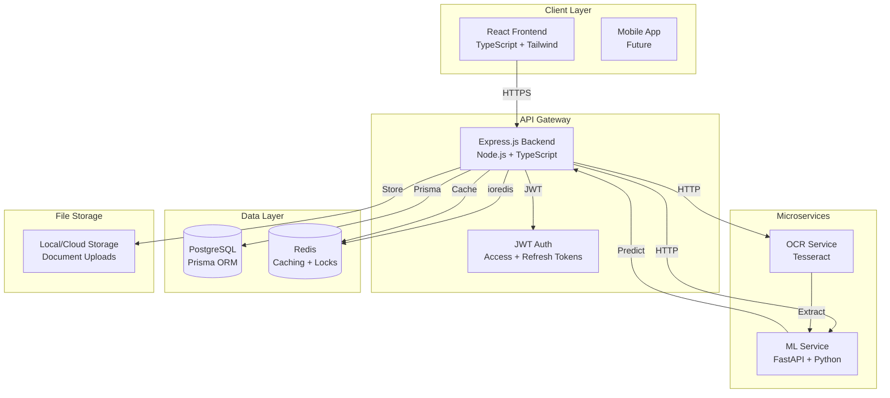

# NeoCareSync - High Risk Pregnancy Monitoring System

## System Architecture



## Project Structure

```
Modex/
├── backend/
│   ├── src/
│   │   ├── modules/
│   │   │   ├── users/
│   │   │   │   ├── user.controller.ts
│   │   │   │   ├── user.service.ts
│   │   │   │   ├── user.routes.ts
│   │   │   │   └── user.types.ts
│   │   │   ├── doctors/
│   │   │   │   ├── doctor.controller.ts
│   │   │   │   ├── doctor.service.ts
│   │   │   │   ├── doctor.routes.ts
│   │   │   │   └── doctor.types.ts
│   │   │   ├── appointments/
│   │   │   │   ├── appointment.controller.ts
│   │   │   │   ├── appointment.service.ts
│   │   │   │   ├── appointment.routes.ts
│   │   │   │   ├── slot.engine.ts
│   │   │   │   └── appointment.types.ts
│   │   │   └── risk/
│   │   │       ├── risk.controller.ts
│   │   │       ├── risk.service.ts
│   │   │       ├── risk.routes.ts
│   │   │       └── risk.types.ts
│   │   ├── prisma/
│   │   │   ├── schema.prisma
│   │   │   └── migrations/
│   │   ├── middleware/
│   │   │   ├── auth.middleware.ts
│   │   │   ├── error.middleware.ts
│   │   │   ├── validation.middleware.ts
│   │   │   └── rateLimit.middleware.ts
│   │   ├── utils/
│   │   │   ├── redis.client.ts
│   │   │   ├── ml.client.ts
│   │   │   ├── ocr.client.ts
│   │   │   ├── logger.ts
│   │   │   └── constants.ts
│   │   ├── config/
│   │   │   ├── database.ts
│   │   │   ├── redis.ts
│   │   │   └── env.ts
│   │   └── server.ts
│   ├── prisma/
│   │   └── schema.prisma
│   ├── Dockerfile
│   ├── docker-compose.yml
│   ├── package.json
│   ├── tsconfig.json
│   └── .env.example
│
├── frontend/
│   ├── src/
│   │   ├── components/
│   │   │   ├── common/
│   │   │   ├── dashboard/
│   │   │   ├── appointments/
│   │   │   ├── risk/
│   │   │   └── forms/
│   │   ├── pages/
│   │   │   ├── PatientDashboard.tsx
│   │   │   ├── DoctorDashboard.tsx
│   │   │   ├── AdminDashboard.tsx
│   │   │   ├── Login.tsx
│   │   │   └── RiskPrediction.tsx
│   │   ├── hooks/
│   │   │   ├── useAuth.ts
│   │   │   ├── useAppointments.ts
│   │   │   └── useRiskPrediction.ts
│   │   ├── api/
│   │   │   ├── client.ts
│   │   │   ├── auth.api.ts
│   │   │   ├── appointments.api.ts
│   │   │   └── risk.api.ts
│   │   ├── styles/
│   │   │   └── globals.css
│   │   ├── App.tsx
│   │   └── main.tsx
│   ├── Dockerfile
│   ├── package.json
│   ├── tsconfig.json
│   ├── tailwind.config.js
│   └── vite.config.ts
│
├── ml-service/
│   ├── app/
│   │   ├── main.py
│   │   ├── models/
│   │   │   └── predictor.py
│   │   └── utils/
│   │       └── feature_engineering.py
│   ├── medicalrisk.csv
│   ├── pregnancy_risk_model.pkl
│   ├── requirements.txt
│   ├── Dockerfile
│   └── .env.example
│
├── docker-compose.yml
├── .gitignore
└── README.md
```

## Implementation Details

### 1. Database Schema (Prisma)

**Location**: `backend/prisma/schema.prisma`

**Models**:

- `User` - Patients and admins (email, password hash, role, profile)
- `Doctor` - Healthcare providers (specialization, license, availability)
- `Appointment` - Booking records (patient, doctor, slot, status, risk_score)
- `RiskPrediction` - ML predictions history (patient, features, risk_level, confidence)
- `Document` - Uploaded medical documents (patient, file_path, ocr_data, extracted_features)

**Key Features**:

- Role-based access (PATIENT, DOCTOR, ADMIN)
- Soft deletes for appointments
- Timestamps on all models
- Indexes on foreign keys and query fields

### 2. Backend API Gateway

**Location**: `backend/src/server.ts`

**Tech Stack**:

- Express.js with TypeScript
- Prisma ORM for database
- ioredis for Redis client
- JWT (jsonwebtoken) for authentication
- Swagger (swagger-ui-express) for documentation
- Zod for validation

**Core Modules**:

#### Users Module (`backend/src/modules/users/`)

- `POST /api/users/register` - Patient registration
- `POST /api/users/login` - JWT token generation
- `POST /api/users/refresh` - Refresh token endpoint
- `GET /api/users/profile` - Get current user profile
- `PUT /api/users/profile` - Update profile

#### Doctors Module (`backend/src/modules/doctors/`)

- `GET /api/doctors` - List all doctors (paginated)
- `GET /api/doctors/:id` - Get doctor details
- `POST /api/doctors` - Create doctor (admin only)
- `PUT /api/doctors/:id/availability` - Update availability slots

#### Appointments Module (`backend/src/modules/appointments/`)

- `GET /api/appointments` - List appointments (role-based filtering)
- `POST /api/appointments` - Create appointment with concurrency protection
- `PUT /api/appointments/:id` - Update appointment
- `DELETE /api/appointments/:id` - Cancel appointment
- `GET /api/appointments/slots` - Get available slots for doctor/date

**Concurrency Protection**:

- Redis distributed lock (2-minute expiry) during booking
- Prisma transaction for atomic slot reservation
- Optimistic locking with version field

#### Risk Module (`backend/src/modules/risk/`)

- `POST /api/risk/predict` - Manual prediction with vitals
- `POST /api/risk/predict-from-document` - Upload document → OCR → Predict
- `GET /api/risk/history/:patientId` - Get prediction history
- `GET /api/risk/trends/:patientId` - Get risk trend over time

**OCR Integration Flow**:

1. Upload document (PDF/image) → Store in local/cloud storage
2. Call OCR service (Tesseract) → Extract text
3. Parse text using regex/NLP → Extract 11 base features
4. Call ML service → Get risk prediction
5. Cache result in Redis (key: `risk:{patientId}:{timestamp}`)
6. Store in database (RiskPrediction + Document tables)

### 3. ML Microservice

**Location**: `ml-service/app/main.py`

**Tech**: FastAPI (better async support than Flask)

**Endpoints**:

- `POST /predict` - Accept 11 base features, return risk level + confidence
- `GET /health` - Health check

**Implementation**:

- Load `pregnancy_risk_model.pkl` on startup
- Load scaler and label encoder (if available, else recreate from notebook logic)
- Feature engineering: Calculate BP_diff, BMI_cat, High_BP, High_HR, Risk_Factors
- StandardScaler transformation
- Model prediction
- Return: `{risk_level: "Low"|"High", confidence: float, probabilities: {...}}`

**Dependencies**: FastAPI, uvicorn, joblib, scikit-learn, numpy, pandas

### 4. OCR Service Integration

**Location**: `backend/src/utils/ocr.client.ts`

**Implementation**:

- Use Tesseract.js (Node.js wrapper) or call Python service
- Extract text from uploaded images/PDFs
- Regex patterns to find:
  - Age: "Age: (\d+)" or "(\d+) years"
  - BP: "BP: (\d+)/(\d+)" or "(\d+)/(\d+) mmHg"
  - Blood Sugar: "BS: (\d+\.?\d*)" or "Glucose: (\d+\.?\d*)"
  - Temperature: "Temp: (\d+\.?\d*)" or "(\d+\.?\d*)°F"
  - BMI: "BMI: (\d+\.?\d*)"
  - Heart Rate: "HR: (\d+)" or "Heart Rate: (\d+)"
  - Binary flags: Check for keywords (diabetes, complications, mental health)

**Alternative**: Create separate Python OCR service if Tesseract.js accuracy is insufficient

### 5. Frontend Application

**Location**: `frontend/src/`

**Tech Stack**:

- React 18 with TypeScript
- Vite for build tooling
- React Query for data fetching/caching
- React Router for navigation
- Tailwind CSS for styling
- Recharts for risk trend visualization
- React Hook Form for forms

**Key Pages**:

#### Patient Dashboard (`frontend/src/pages/PatientDashboard.tsx`)

- Risk score card (current + trend chart)
- Upcoming appointments list
- Quick risk prediction form
- Document upload area
- Missed appointment alerts

#### Doctor Dashboard (`frontend/src/pages/DoctorDashboard.tsx`)

- Patient list with risk scores
- Appointment calendar view
- Patient detail modal
- Risk history visualization

#### Admin Dashboard (`frontend/src/pages/AdminDashboard.tsx`)

- System statistics
- User management
- Doctor management
- Appointment analytics

#### Risk Prediction Form (`frontend/src/pages/RiskPrediction.tsx`)

- Manual input form (11 fields)
- Document upload option
- Real-time prediction display
- Historical predictions table

### 6. Redis Caching Strategy

**Keys**:

- `risk:{patientId}:{timestamp}` - Risk prediction cache (TTL: 1 hour)
- `appointment:lock:{doctorId}:{slot}` - Booking lock (TTL: 2 minutes)
- `appointment:pending:{appointmentId}` - Pending booking state (TTL: 2 minutes)
- `slots:{doctorId}:{date}` - Available slots cache (TTL: 5 minutes)

### 7. Docker Configuration

**Root `docker-compose.yml`**:

```yaml
services:
  postgres:
    image: postgres:15
    environment: ...
    volumes: ...
  
  redis:
    image: redis:7-alpine
    ports: ...
  
  backend:
    build: ./backend
    depends_on: [postgres, redis]
    ports: ["3000:3000"]
    environment: ...
  
  ml-service:
    build: ./ml-service
    ports: ["8000:8000"]
    volumes: ["./ml-service:/app"]
  
  frontend:
    build: ./frontend
    ports: ["5173:5173"]
    depends_on: [backend]
```

### 8. Deployment Configuration

**Backend (Railway/Render)**:

- Environment variables for DB, Redis, ML service URL
- Build command: `npm run build`
- Start command: `npm start`
- Health check endpoint: `GET /health`

**Frontend (Vercel)**:

- Build command: `npm run build`
- Output directory: `dist`
- Environment variables: `VITE_API_URL`

**ML Service (Railway)**:

- Python runtime
- Build: `pip install -r requirements.txt`
- Start: `uvicorn app.main:app --host 0.0.0.0 --port 8000`

**Database**: Supabase PostgreSQL (serverless)

**Redis**: Upstash (serverless Redis)

### 9. Swagger Documentation

**Location**: `backend/src/server.ts`

- Auto-generate from route definitions
- Include request/response schemas
- Authentication examples
- Deploy at `/api-docs`

### 10. Security Considerations

- JWT tokens with 15min access, 7day refresh
- Password hashing with bcrypt (salt rounds: 10)
- Rate limiting (100 req/min per IP)
- CORS configuration for frontend domain
- Input validation with Zod schemas
- SQL injection protection (Prisma parameterized queries)
- File upload size limits (10MB max)
- File type validation (PDF, PNG, JPG only)

## Implementation Order

1. **Phase 1**: Database schema + Prisma setup
2. **Phase 2**: Backend core (auth, users, doctors)
3. **Phase 3**: ML service + integration
4. **Phase 4**: Appointments module + concurrency
5. **Phase 5**: OCR integration + risk prediction
6. **Phase 6**: Frontend core (auth, routing)
7. **Phase 7**: Frontend dashboards
8. **Phase 8**: Docker setup
9. **Phase 9**: Swagger docs + testing
10. **Phase 10**: Deployment configs

## Key Files to Create

- `backend/prisma/schema.prisma` - Complete database schema
- `backend/src/modules/appointments/slot.engine.ts` - Slot scheduling logic
- `backend/src/utils/redis.client.ts` - Redis connection + helper functions
- `backend/src/utils/ml.client.ts` - HTTP client for ML service
- `backend/src/utils/ocr.client.ts` - OCR extraction logic
- `ml-service/app/models/predictor.py` - Model loading + prediction
- `ml-service/app/utils/feature_engineering.py` - Feature derivation
- `frontend/src/hooks/useRiskPrediction.ts` - React Query hook for predictions
- `docker-compose.yml` - All services orchestration