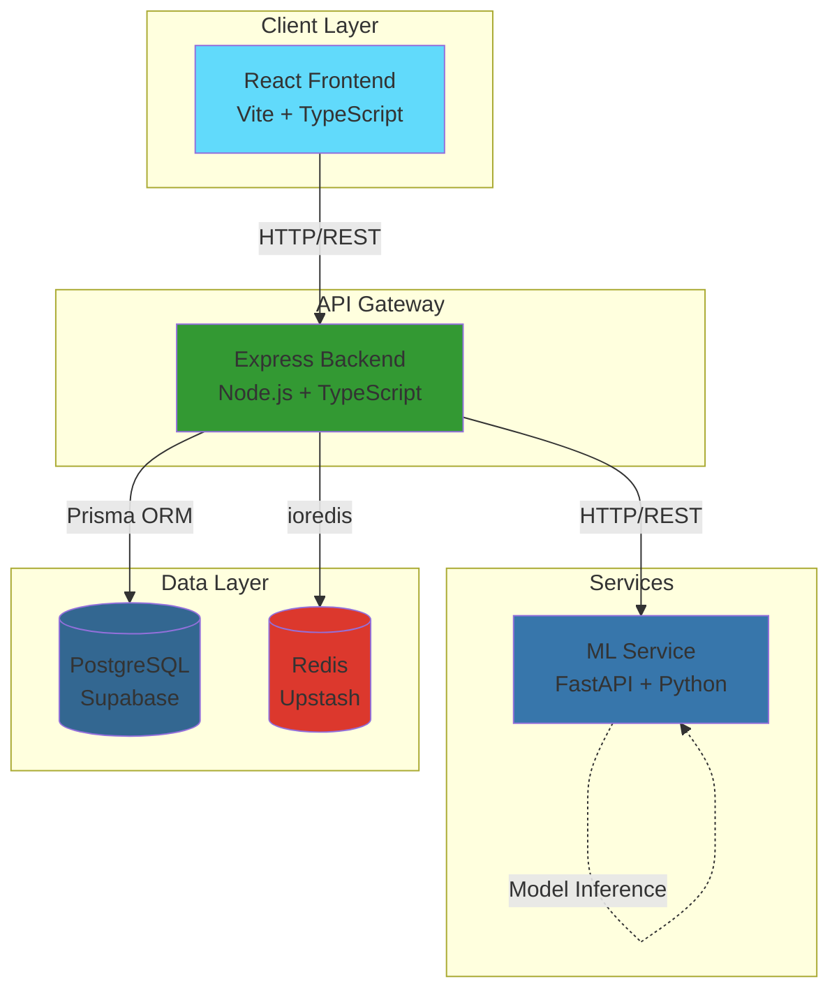
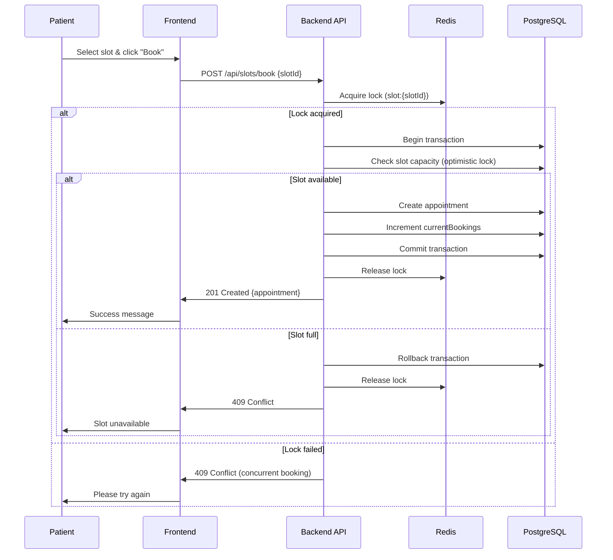

# NeoCareSync System Design

## High-Level Architecture



## Data Flow

### Booking Sequence



## Database Schema

### Core Models

#### User
```typescript
{
  id: string (UUID)
  email: string (unique)
  passwordHash: string
  role: 'PATIENT' | 'DOCTOR' | 'ADMIN'
  firstName: string?
  lastName: string?
  phone: string?
  dateOfBirth: DateTime?
  address: string?
  insuranceProvider: string?
  insurancePolicyNumber: string?
  isActive: boolean
  createdAt: DateTime
  updatedAt: DateTime
}
```

#### Doctor
```typescript
{
  id: string (UUID)
  userId: string (FK -> User)
  specialization: string
  licenseNumber: string
  yearsOfExperience: number?
  bio: string?
  isAvailable: boolean
  status: 'PENDING' | 'APPROVED' | 'REJECTED' | 'SUSPENDED'
  departmentId: string? (FK -> Department)
  licenseDocumentPath: string?
  rejectionReason: string?
  approvedAt: DateTime?
  approvedBy: string?
  createdAt: DateTime
  updatedAt: DateTime
}
```

#### Slot
```typescript
{
  id: string (UUID)
  doctorId: string (FK -> User)
  slotDate: DateTime
  startTime: string (HH:mm)
  endTime: string (HH:mm)
  maxCapacity: number (default: 6)
  currentBookings: number (default: 0)
  isActive: boolean
  version: number (optimistic locking)
  createdAt: DateTime
  updatedAt: DateTime
}
```

#### Appointment
```typescript
{
  id: string (UUID)
  patientId: string (FK -> User)
  doctorId: string (FK -> User)
  slotId: string? (FK -> Slot)
  appointmentDate: DateTime
  startTime: string (HH:mm)
  endTime: string (HH:mm)
  status: 'PENDING' | 'CONFIRMED' | 'COMPLETED' | 'CANCELLED' | 'MISSED'
  bookingStatus: 'PENDING' | 'CONFIRMED' | 'FAILED'
  attendanceStatus: 'PENDING' | 'ATTENDED' | 'NOT_ATTENDED'?
  notes: string?
  riskScore: 'LOW' | 'HIGH'?
  isPriority: boolean (high-risk patients)
  version: number (optimistic locking)
  createdAt: DateTime
  updatedAt: DateTime
  cancelledAt: DateTime?
}
```

#### RiskPrediction
```typescript
{
  id: string (UUID)
  patientId: string (FK -> User)
  
  // Base features (11)
  age: number
  systolicBp: number
  diastolicBp: number
  bloodSugar: number
  bodyTemp: number
  bmi: number
  previousComplications: number (0 or 1)
  preexistingDiabetes: number (0 or 1)
  gestationalDiabetes: number (0 or 1)
  mentalHealth: number (0 or 1)
  heartRate: number
  
  // Derived features (5)
  bpDiff: number?
  bmiCat: number?
  highBp: number?
  highHr: number?
  riskFactors: number?
  
  // Prediction results
  riskLevel: 'LOW' | 'HIGH'
  confidence: number
  probabilities: JSON? ({ "Low": 0.95, "High": 0.05 })
  explanation: string?
  createdAt: DateTime
}
```

#### MedicalRecord
```typescript
{
  id: string (UUID)
  patientId: string (FK -> User)
  doctorId: string (FK -> Doctor)
  appointmentId: string? (FK -> Appointment)
  recordType: 'CONSULTATION' | 'LAB_REPORT' | 'DIAGNOSIS' | 'TREATMENT' | 'FOLLOW_UP'
  diagnosis: string?
  notes: string?
  labResults: JSON?
  treatmentPlan: string?
  followUpDate: DateTime?
  attachments: JSON? (array of file paths)
  createdAt: DateTime
  updatedAt: DateTime
}
```

#### Prescription
```typescript
{
  id: string (UUID)
  patientId: string (FK -> User)
  doctorId: string (FK -> Doctor)
  appointmentId: string?
  medications: JSON (array of { name, dosage, frequency, duration, instructions })
  notes: string?
  isActive: boolean
  createdAt: DateTime
  updatedAt: DateTime
}
```

#### Payment
```typescript
{
  id: string (UUID)
  patientId: string (FK -> User)
  appointmentId: string? (FK -> Appointment, unique)
  amount: number
  status: 'PENDING' | 'COMPLETED' | 'FAILED' | 'REFUNDED'
  paymentMethod: 'CASH' | 'CARD' | 'ONLINE' | 'INSURANCE'
  transactionId: string? (unique)
  invoiceNumber: string? (unique)
  description: string?
  paidAt: DateTime?
  createdAt: DateTime
  updatedAt: DateTime
}
```

## Concurrency Solution

### Problem
Multiple patients attempting to book the same slot simultaneously can lead to overbooking.

### Solution: Redis Distributed Locks + Prisma Transactions

#### 1. Redis Lock Acquisition
```typescript
const lockKey = `slot:${slotId}:lock`;
const lockValue = `${userId}:${Date.now()}`;
const lockTTL = 120; // 2 minutes

const acquired = await redis.set(lockKey, lockValue, 'EX', lockTTL, 'NX');
```

#### 2. Prisma Transaction with Optimistic Locking
```typescript
await prisma.$transaction(async (tx) => {
  // Read slot with current version
  const slot = await tx.slot.findUnique({
    where: { id: slotId },
  });
  
  // Check capacity
  if (slot.currentBookings >= slot.maxCapacity) {
    throw new Error('Slot full');
  }
  
  // Create appointment and update slot atomically
  const appointment = await tx.appointment.create({ ... });
  await tx.slot.update({
    where: { id: slotId, version: slot.version }, // Optimistic lock
    data: {
      currentBookings: { increment: 1 },
      version: { increment: 1 },
    },
  });
  
  return appointment;
});
```

#### 3. Lock Release
```typescript
await redis.del(lockKey);
```

### Benefits
- **Distributed**: Works across multiple backend instances
- **Timeout Protection**: 2-minute expiry prevents deadlocks
- **Optimistic Locking**: Version field prevents race conditions
- **Atomic Operations**: Prisma transactions ensure data consistency

## Scaling Plan

### Current Architecture (Single Instance)

```
Frontend (Vercel) → Backend (Railway) → PostgreSQL (Supabase)
                              ↓
                         Redis (Upstash)
                              ↓
                         ML Service (Railway)
```

### Horizontal Scaling Strategy

#### 1. Database Scaling
- **Read Replicas**: Deploy PostgreSQL read replicas for analytics queries
- **Connection Pooling**: Use PgBouncer or Supabase connection pooling
- **Query Optimization**: Add indexes on frequently queried fields
- **Partitioning**: Partition large tables (appointments, activity_logs) by date

#### 2. Redis Scaling
- **Redis Cluster**: Migrate to Redis Cluster for high availability
- **Sharding**: Shard by slot ID or user ID for distributed locks
- **Cache Warming**: Pre-populate frequently accessed data

#### 3. Backend Scaling
- **Load Balancer**: Deploy multiple backend instances behind a load balancer
- **Stateless Design**: Ensure all instances share Redis and database
- **Health Checks**: Implement health check endpoints for load balancer
- **Rate Limiting**: Use Redis for distributed rate limiting

#### 4. ML Service Scaling
- **Load Balancing**: Deploy multiple ML service instances
- **Model Caching**: Cache model predictions in Redis (1-hour TTL)
- **Async Processing**: Queue long-running predictions for batch processing
- **Model Versioning**: Support A/B testing with multiple model versions

### Scaling Architecture (Future)

```mermaid
graph TB
    subgraph "CDN"
        CDN[Cloudflare CDN]
    end
    
    subgraph "Load Balancer"
        LB[NGINX/HAProxy]
    end
    
    subgraph "Frontend"
        FE1[Vercel Instance 1]
        FE2[Vercel Instance 2]
    end
    
    subgraph "Backend Cluster"
        BE1[Backend Instance 1]
        BE2[Backend Instance 2]
        BE3[Backend Instance 3]
    end
    
    subgraph "ML Service Cluster"
        ML1[ML Service 1]
        ML2[ML Service 2]
    end
    
    subgraph "Data Layer"
        PG_MASTER[(PostgreSQL Master)]
        PG_REPLICA[(PostgreSQL Replica)]
        RD_CLUSTER[(Redis Cluster)]
    end
    
    CDN --> LB
    LB --> FE1
    LB --> FE2
    FE1 --> BE1
    FE1 --> BE2
    FE2 --> BE3
    BE1 --> PG_MASTER
    BE2 --> PG_REPLICA
    BE3 --> PG_REPLICA
    BE1 --> RD_CLUSTER
    BE2 --> RD_CLUSTER
    BE3 --> RD_CLUSTER
    BE1 --> ML1
    BE2 --> ML2
```

### Performance Targets

- **Response Time**: < 200ms for API endpoints (p95)
- **Throughput**: 1000 requests/second per backend instance
- **Concurrent Bookings**: Support 100 simultaneous booking attempts
- **ML Prediction**: < 500ms for risk prediction
- **Database**: < 50ms query time (p95)

### Monitoring & Observability

- **APM**: Use New Relic or Datadog for application performance monitoring
- **Logging**: Centralized logging with structured logs (JSON)
- **Metrics**: Prometheus + Grafana for system metrics
- **Alerts**: Set up alerts for error rates, latency spikes, and capacity limits
